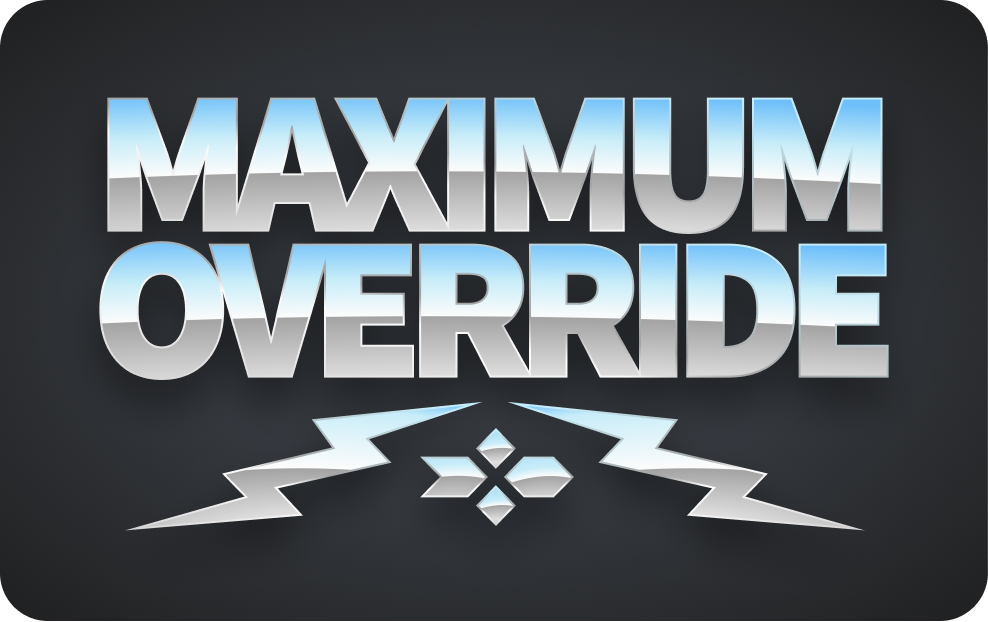

# Maximium Override

### Take control of your Figma overrides!

Compare objects to see what's different, then copy and paste the changes. Compare instances to their default master symbol and copy and paste the overrides.

[https://www.figma.com/community/plugin/844697202715835091/Maximum-Override](https://www.figma.com/community/plugin/844697202715835091/Maximum-Override)

 

---

## Features

### **1. Copy and paste overrides between symbols**

Two of Figma's greatest strengths are:
1. Overriding colors, text, and other properties on component instances, and 
2. Swapping out instances of components, such as a icons or states.

But when you swap an instance, you lose all the overrides you've made, including changes to nested instances within a parent component.

Maximum Override allows you to copy your overrides, swap out an instance, and then paste the overrides back onto the new instance, to retain all of your changes. This includes nested instances that you've swapped with a different symbol.

### **2. Compare properties between objects**

Maximum Override also allows you to select any two nodes on the stage and compare them against each other to see what's different. (In software, this is known as a "diff".) You can then copy the changes from object A to object B, or vice-versa. If you select a single instance, Maximum Override will compare it against its own master component.

 

---
## Usage

Install and run Maximum Override like any other Figma plugin. See [Figma's plugin guide](https://help.figma.com/hc/en-us/articles/360040450413-Browse-and-Install-Plugins#Install_a_Plugin).

### Comparing

Select a single component instance to compare it against its own master component.

Select two items to compare them to each other. These can be any type of object on stage, including instances. Click "Swap" to change which is the source and which is the target of the overrides.

By default, Maximum Override will collapse all the nodes that don't contain overrides, but you can click the title of any node to expand and see its children.

To save space while you work, you can also collapse the header, and the interface window will collapse as well.

Within overrides, hover over colors to see the corresponding hex value.

### Copying

Click "Copy overrides" to save the current set of target overrides. This data is saved locally on your computer and will persist when you close the plugin or close Figma.

### Pasting

Select a single item and click "Paste overrides" to apply the saved overrides to the selected item. If the structure of the target item doesn't match the structure that the overrides were originally pulled from, Maximum Override will still attempt to apply the overrides, but results may vary.

 

---

### Not Supported (yet) / Known Issues

#### Very large components

Components with large numbers of layers and nested instances may be quite slow to process. Future versions may include a progress bar and other optimizations.

#### Multiple text styles

Text layers get very complicated, since each character can have its own set of styles and overrides. Maximum Override currently assumes that there is only one font / style applied to a given text field.

 

---

### Development

To build:

    $ npm install

To run locally:

    $ npm run start
